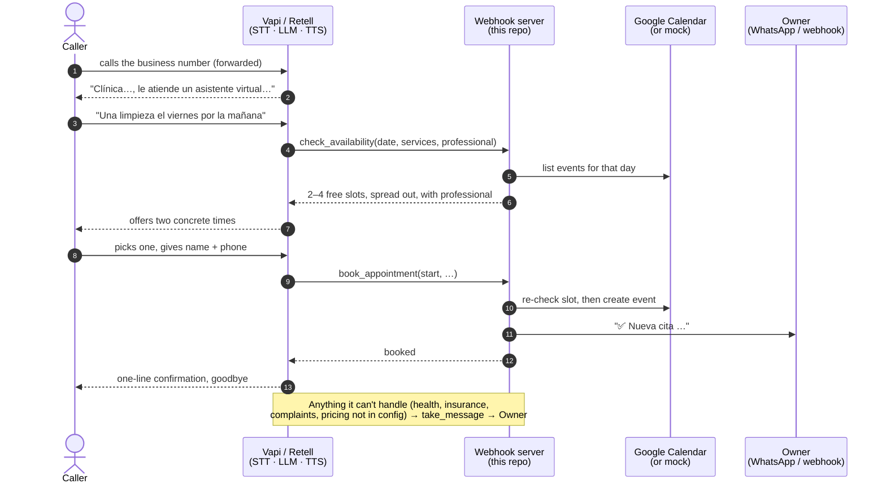

# Voice Receptionist (ES) — AI phone agent that books appointments

[](https://www.repostatus.org/#unsupported)
[](https://github.com/pedrozapatadev/voice-receptionist-demo/actions/workflows/test.yml)


A Spanish-speaking AI receptionist for small appointment-based businesses (clinics,
barbers, physios). It answers the phone, finds a real free slot, books it into Google
Calendar, and messages the owner. It runs on **Vapi** or **Retell**.

> [!IMPORTANT]
> **Status: archived demo. This is not a live service.** It's a cleaned-up extract of
> work from a Madrid voice-agent startup I co-founded. We built on Vapi and Bland AI and
> later moved to Retell, and we tested the receptionist end to end. The
> company never signed a paying client and has wound down. Nothing here runs in
> production, and the clinic in the examples is fictional. The repo is unmaintained, and
> the Vapi and Retell APIs may have changed since.

## What's in here, honestly

| Part | Origin | How it's verified |
|---|---|---|
| Prompt design: core rules + appointments vertical ([`agent/`](agent/)) | From the company's work. Cleaned, with a fictional business | Manual test calls at the time, using the [QA plan](docs/qa-plan.md) |
| Config-driven prompt builder ([`scripts/build-prompt.mjs`](scripts/build-prompt.mjs)) | From the company's work. Adapted for two platforms | `npm test` |
| QA plan ([`docs/qa-plan.md`](docs/qa-plan.md)) | From the company's work. Translated | It is the manual test |
| Webhook server: availability, booking, Google Calendar, notifications ([`server/`](server/)) | **Written for this public repo.** At the company, booking ran through Retell's built-in calendar integration. This version re-implements that flow in the open so it can be read, tested and run without an account | 26 automated tests + [offline simulator](docs/sample-run.md). **Not yet tested on a live call** |

| Real | Mocked / placeholder |
|---|---|
| Slot logic: hours, holidays, durations, buffers, who does what | The business (fictional clinic, fictional staff) |
| Vapi + Retell webhook handling, Retell HMAC signature check | Calendar by default (`CALENDAR_BACKEND=mock`) |
| Google Calendar adapter (service account, REST) | Phone numbers: none in the repo. Bring your own |
| Owner notification via webhook or Twilio WhatsApp | Simulator dialogue lines (scripted, not LLM output) |

## How a call flows



Three tools, defined once in [`agent/tools.json`](agent/tools.json):
`check_availability`, `book_appointment`, `take_message`.

## Run it in 30 seconds (no account needed)

```bash
git clone https://github.com/pedrozapatadev/voice-receptionist-demo
cd voice-receptionist-demo
npm test            # 26 tests, zero dependencies to install
npm run simulate    # a scripted booking call through the real webhook handler
```

The simulator output is checked in at [`docs/sample-run.md`](docs/sample-run.md).

## Run it against a Vapi or Retell trial account

Both platforms give trial credit, and both let you test with a **web call** from the
dashboard, so you don't need a phone number.

**1. Start the server and expose it**

```bash
cp .env.example .env          # set VAPI_SECRET and/or RETELL_API_KEY
npm start                     # http://localhost:3000, mock calendar
cloudflared tunnel --url http://localhost:3000    # or: ngrok http 3000
```

**2. Build the prompt for your platform**

```bash
npm run build:prompt          # → dist/prompt.{vapi,retell}.md + dist/first-message.*.txt
```

The builder injects the platform's own current-time variable (Vapi's Liquid `now`,
Retell's `current_time_Europe/Madrid`). The agent never guesses what "mañana" means.

**3a. Vapi**
1. Create an assistant. Paste `dist/prompt.vapi.md` as the system prompt and
   `dist/first-message.vapi.txt` as the first message.
2. Set the transcriber language to Spanish and choose a Castilian Spanish voice.
3. Create a **Bearer token credential** whose value is your `VAPI_SECRET`.
4. Add three **function tools** using the schemas in `agent/tools.json`. Set the server
   URL to `https://<your-tunnel>/vapi` and attach the credential.
5. Talk to it from the dashboard.

**3b. Retell**
1. Create a single-prompt agent. Paste `dist/prompt.retell.md` as the prompt and
   `dist/first-message.retell.txt` as the begin message.
2. Choose a Spanish (Spain) voice and language.
3. Add three **custom functions** from `agent/tools.json`, each pointing at
   `https://<your-tunnel>/retell`.
4. Set `RETELL_API_KEY` in `.env` so the server verifies `X-Retell-Signature`.
5. Start a web call from the dashboard.

**4. Real calendar (optional).** Create a Google Cloud service account with the Calendar
API enabled and download its JSON key. Keep the key **outside** the repo. Share the
target calendar with the service account's email ("Make changes to events"). Then set:

```bash
CALENDAR_BACKEND=google
GOOGLE_CALENDAR_ID=…
GOOGLE_SERVICE_ACCOUNT_KEY_FILE=/path/outside/repo/key.json
```

Events record the professional in a private extended property. Events with no
professional (a training day, say) block everyone.

**5. Owner notifications (optional).** Notifications always go to the console. Set
`NOTIFY_WEBHOOK_URL` to send them to Slack, Discord, Make or n8n, or set the `TWILIO_*`
variables to send WhatsApp (the Twilio sandbox works for testing). A failed notification
never undoes a booking, and the agent is told the owner wasn't notified.

**6. A Spanish phone number (if you go further).** When we built this, neither Vapi nor
Retell sold Spanish numbers directly. You buy a +34 number from a carrier (Twilio,
Telnyx) and connect it over a SIP trunk. Spanish geographic numbers need ID and proof of
address in the matching province, and validation takes days. The business keeps its
existing number and forwards calls to the agent.

## Design decisions

- **The server enforces the rules; the prompt only describes them.** Opening hours,
  holidays, real service durations, buffers between appointments, and which professional
  does what are all checked in [`server/availability.mjs`](server/availability.mjs). The
  LLM can't book a 45-minute slot for a 105-minute job, or give Dr. Martín a root canal,
  however the caller phrases it. `book_appointment` re-checks the slot against the live
  calendar right before writing.
- **Prompts are never edited per business.** One `config.yaml` per business. The builder
  merges it with the shared core rules and the vertical prompt. Onboarding a business
  means filling in a config, not prompt-engineering.
- **"Never invent" is the top rule.** The agent may only state what's in the config or
  what a tool returned. Health, allergies, insurance, complaints and prices not in the
  config always go to a human. Health data (GDPR Art. 9) is never written into notes.
- **AI disclosure in the first sentence.** EU AI Act Art. 50 requires people to be told
  they're talking to an AI system. It's in the first message and enforced by a test.
- **Phone register, not chat register.** One or two short sentences per turn, no lists, no
  corporate filler, times said the way people say them, and tú/usted fixed per business.
- **Vapi always gets HTTP 200.** Vapi ignores non-2xx bodies, so a failing tool returns
  200 with an `error` string the agent can read out, never a 500 that turns into silence.
- **Calendar + notification first, booking-system integrations later.** Many Spanish
  businesses use booking systems with no open API. Writing to Google Calendar and
  messaging the owner works on day one and doesn't break when a vendor changes its
  back office.
- **Zero runtime dependencies.** Node 22 built-ins only: `fetch`, `crypto`, `node:test`.
  Nothing to audit, nothing to go stale.

## Known limitations

- No cancel or reschedule tool. Those requests become a message for the team (by design in
  v1, but a real deployment would want them).
- Call transfer is left to the platform's built-in transfer feature and isn't implemented
  here.
- The mock calendar is single-process. There's no rate limiting and no persistence layer.
- No recording or consent flow. If you turn recording on, the greeting must say so (the
  config supports `aviso_grabacion`). Check current AEPD guidance. Nothing here is
  legal advice.

## Layout

```
agent/
  core-rules.md            shared rules: disclosure, register, dates, never-invent, escalation, GDPR
  appointments.prompt.md   appointments vertical (clinic · barber · physio)
  config.example.yaml      one business = one config (fictional)
  tools.json               the three tool schemas
scripts/
  build-prompt.mjs         core + vertical + config → dist/prompt.<platform>.md
  simulate-call.mjs        offline booking call through the webhook handler
server/
  availability.mjs         slot rules (pure)
  tools.mjs                check_availability · book_appointment · take_message
  http.mjs                 /vapi and /retell adapters, auth, signature check
  calendar/mock.mjs        in-memory calendar (+ JSON mirror)
  calendar/google.mjs      Google Calendar over REST with a service account
  notify.mjs               console · webhook · Twilio WhatsApp
docs/
  qa-plan.md               the 22-check live-call test plan
  sample-run.md            real simulator output
```

## License

MIT © Pedro Zapata Medal
